# Landing page and dashboard

`/` serves the approved [PR #14 landing page](https://github.com/pinecone-studio/pinequest-s5-episode-1-team-14/pull/14).
Its source lives in `public/landing/`; a Next.js rewrite serves the standalone
HTML with its own layout and scripts. The hero's
dashboard link opens `/dashboard`. See [landing setup](docs/landing.md) for files,
demo placeholders and external Tailwind CDN/Google Fonts requirements.

`/dashboard` opens the dashboard. The `(workspace)` route group shares the top
navigation, header and content frame across Dashboard, Calls, Bookings, Knowledge
and Analytics. Navigation labels are Mongolian. Future
Demo and Settings sections are visibly disabled
until their own feature PRs add working routes.

The overview currently shows empty metrics/activity and unknown connection
states. It does not read backend data or imply that an integration is online.
Keep actual data loading, authentication and remaining feature pages in separate PRs.

Workspace styles use plain CSS and the landing's shared palette and Google Fonts
(Manrope/Unbounded, with system fallbacks). `public/theme.css` is the single source
for both documents' colors/fonts; `public/theme-init.js` restores the `theme`
preference before rendering. The header button cycles automatic, light and dark
modes; the same preference survives navigation between landing and workspace.
If browser storage is unavailable, switching still works for the current document.
Small screens use a native `details` menu, while a skip link, focus indicators and
active-page semantics support keyboard users. No UI dependency is added.

From the repository root:

```bash
npm run lint
npm run build:pwa
npm run start --workspace=pwa -- --hostname 127.0.0.1 --port 3100
```

Open `http://127.0.0.1:3100/dashboard`. Check desktop and 320px mobile layouts; Tab/Enter
the skip link, open/close the mobile menu, and follow the connections anchor.
Disabled future sections must not navigate to missing pages.

An optional assertion-based browser check uses an installed Chrome and temporary
Playwright Core tooling, without adding it to this project's dependency graph.
PowerShell (in another terminal while the production server is running):

```powershell
$browserCheckDir = Join-Path $env:TEMP 'codex-pr11-browser-check'
npm.cmd install --prefix $browserCheckDir --no-package-lock --ignore-scripts --no-audit --no-fund playwright-core@1.64.0
$env:NODE_PATH = Join-Path $browserCheckDir 'node_modules'
node pwa/scripts/check-dashboard.cjs
node pwa/scripts/check-landing.cjs
node pwa/scripts/check-workspace-theme.cjs
```

`DASHBOARD_URL` optionally selects a different local server. The check verifies
direct dashboard access, keyboard focus, menu behavior, five viewport widths and runtime
errors. It also refreshes the review screenshots in `pwa/docs/`. This optional
browser check is separate from the existing CI lint/build checks.

The landing check covers `/`, local assets, theme persistence, demo dialogs,
anchor navigation, reduced motion, five widths and the link into the dashboard.
Landing screenshots are also written to `pwa/docs/`.

The workspace theme check covers all five routes in dark mode, shared landing
colors/fonts, theme persistence across navigation/reload, system preference,
blocked browser storage and the mobile menu. It also saves dark-mode screenshots.

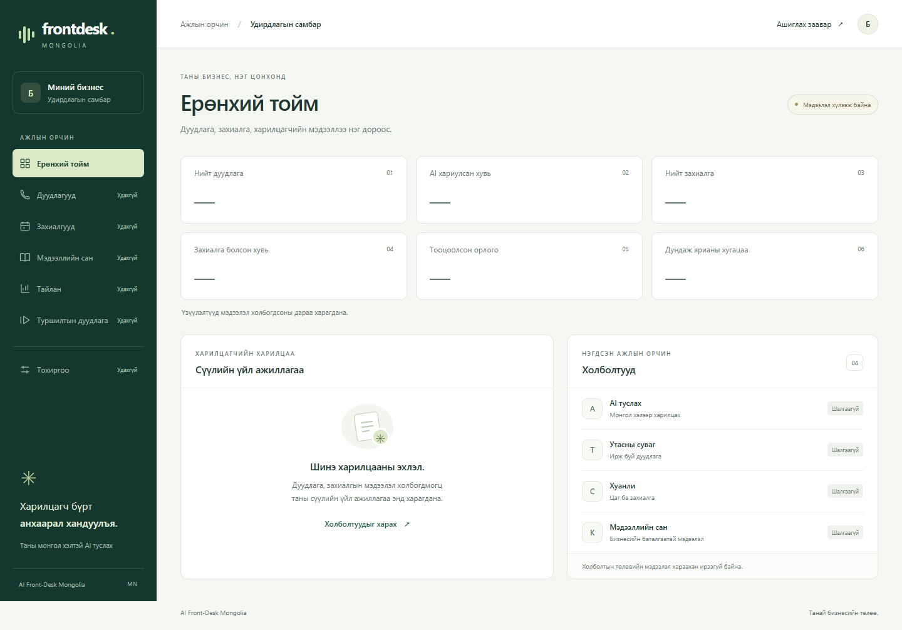
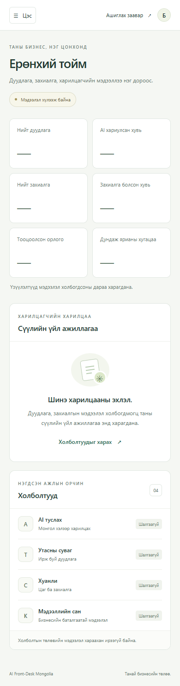

## Vercel preview

Deploy from the **repository root**, with the Vercel project's Root Directory set
to `pwa`, framework **Next.js**, Node **24.x**, and **Include source files outside
of the Root Directory** enabled. The workspace lockfile and backend type-only
imports must remain available during the build. Set Install Command to
`cd .. && npm ci --workspaces --include=dev` so backend dependencies are also
available for type checking; keep the default Next.js Build Command.
See [Vercel's monorepo guide](https://vercel.com/docs/monorepos).

```powershell
vercel link --yes --project ai-frontdesk-mongolia --scope 123uuganas-projects
vercel deploy --target preview --build-env NEXT_PUBLIC_USE_MOCK_API=true --yes
```

This preview uses clearly labelled synthetic data. It deploys only the frontend;
Twilio, Calendar and AI services are not hosted or connected by this command.
`.vercelignore` excludes local environment files, backend data and review assets.
No provider keys are required. Vercel may classify the first deployment of a new
project as Production; subsequent preview URLs may require Vercel account access.
This is a manual CLI deployment. PR review/merge is separate, and GitHub automatic
deployments are not connected by these instructions.

## Calls

`/calls` shows the six call-history fields, phone/ID search, combined status
filtering and expandable end-time/booking details. Times use `Asia/Ulaanbaatar`
regardless of the browser's timezone. Durations are minutes:seconds; active calls
have no final duration. The table scrolls horizontally on narrow screens and is
keyboard focusable. Unknown phone/intent values have explicit labels.

The backend has storage but no call-list HTTP API or authentication yet. The
default view therefore shows a connection-pending empty state. To preview the UI,
set `NEXT_PUBLIC_USE_MOCK_API=true` in `pwa/.env.local` (see `.env.example`) and
restart development or rebuild production. The badge and notice identify every
preview as synthetic. Six centralized fixtures live in `lib/calls.ts`; their
phone numbers, IDs and bookings are invented. No backend files are read or exposed.
Both the service and component reuse the backend `CallSession` via type-only imports.
Replace the service with the reviewed authenticated API in the integration PR;
there is no live refresh, transcript, recording or booking modification here.

Using the same temporary browser tooling and running server described above:

```powershell
# Match the setting used to build the running app: true for demo, false otherwise.
$env:EXPECT_MOCK_CALLS = 'true'
node pwa/scripts/check-calls.cjs
```

Run the check against both builds (`NEXT_PUBLIC_USE_MOCK_API=true` and `false`).
It verifies navigation, all statuses, search/filter reset, unknown values,
keyboard details/scrolling, Ulaanbaatar day boundaries, five widths, the empty
state and browser runtime errors. Demo mode refreshes these review screenshots:

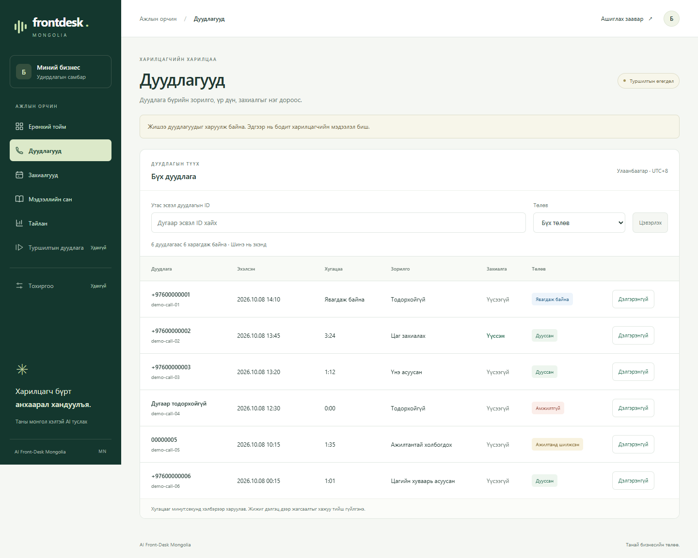
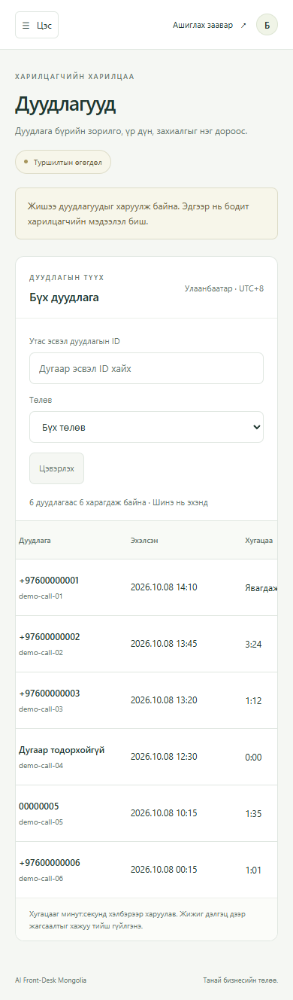

## Bookings

`/bookings` lists customers, phone numbers, services, start times, durations,
statuses and sources. Search by customer, formatted phone, service or booking ID,
and combine the search with a day filter in `Asia/Ulaanbaatar`. All dates use the
same formatter as Calls. Results are ordered by appointment start, earliest first.
Expand a row for booking/service IDs, the Calendar event ID and the end time.

`lib/bookings.ts` reuses the backend `Booking` type through a type-only import.
The current contract supports only `confirmed` and `AI_PHONE_AGENT`; the UI does
not invent cancellation or completion states. The page reuses the Calls table,
filter and responsive styles without adding a UI dependency.

The same `NEXT_PUBLIC_USE_MOCK_API=true` flag enables six explicitly labelled,
synthetic bookings; otherwise the page shows a connection-pending empty state.
These fixtures are not real Calendar events. There is no booking-list API or
authentication yet, so no backend data or credentials are loaded into the page.
Live listing and create/edit/cancel actions belong to a separate integration PR.

With the temporary browser tooling and running app from the instructions above:

```powershell
$env:EXPECT_MOCK_BOOKINGS = 'true' # Match the build's mock flag; also check false.
node pwa/scripts/check-bookings.cjs
```

The browser check covers sorting, search, combined local-day filtering across UTC
midnight, reset/empty results, keyboard details/scrolling, mobile navigation and
five viewport widths. Run the Calls check too when changing the shared formatter.

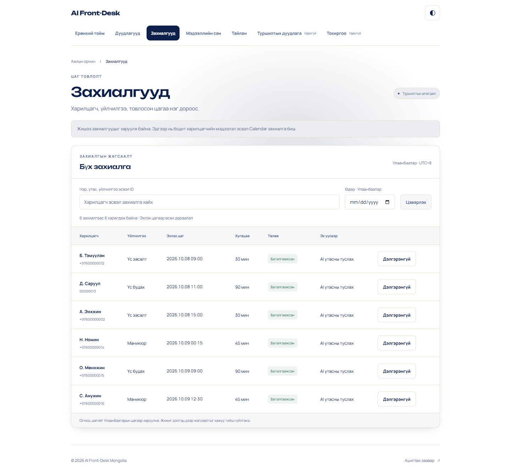
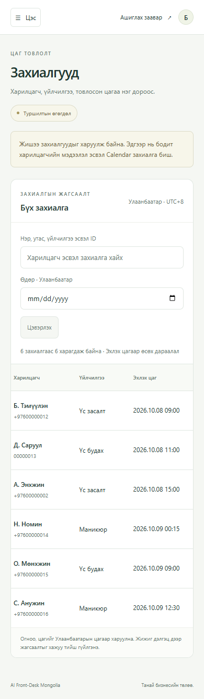

## Knowledge

`/knowledge` lists all seven backend knowledge categories with title, content,
optional MNT price, approval state and the last update in Ulaanbaatar time.
Search title/content/ID and combine category and approval filters. Newest updates
appear first. The page reuses the backend `KnowledgeItem` through type-only imports.

The existing `NEXT_PUBLIC_USE_MOCK_API=true` flag enables seven centralized,
synthetic records and page-local create/edit/delete controls. The notice and save
feedback explain that edits disappear on reload/navigation and do not affect the
real AI knowledge store. With the flag off, the page shows a connection-pending
state and disables editing. No API, backend file or browser storage is accessed.

New records and edits start as drafts. Approval requires an explicit checkbox;
changing title, category, content or price clears that approval. Blank/whitespace
text and invalid or negative prices are rejected; zero is valid and an empty price
removes it. Delete asks for confirmation. Forms focus the title on opening and
return focus to the list heading on save/cancel. Live persistent CRUD must use an
authenticated, authorized management API in the integration work.

With the optional browser tooling and running app described above:

```powershell
$env:EXPECT_MOCK_KNOWLEDGE = 'true' # Match the build flag; also check false.
node pwa/scripts/check-knowledge.cjs
```

This checks combined filters, draft/approval behavior, create/edit/delete and
cancel paths, price validation, focus, reload reset, five widths and navigation.

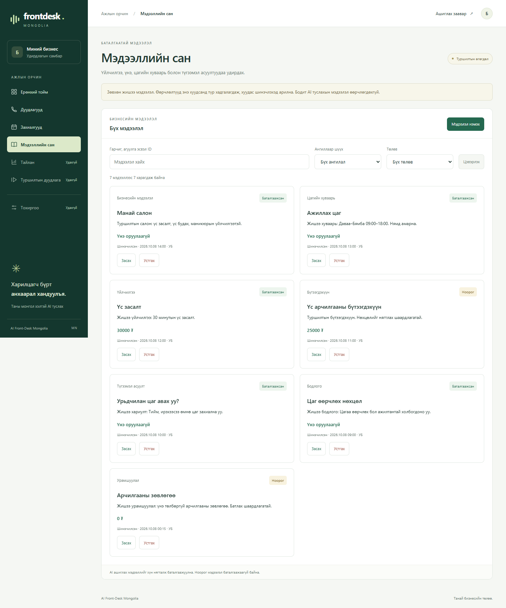
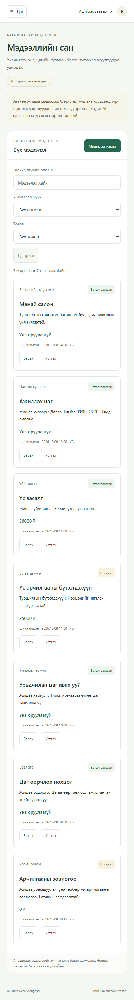

## Analytics

`/analytics` reports call/booking totals, completed calls, booking conversion and
average call duration, with status/intent bars and a daily table. Select one day
or all available data. Every date uses `Asia/Ulaanbaatar`, including calls/bookings
near UTC midnight. The top navigation and mobile menu both enable **Тайлан**.

The page reuses `getCalls()` and `getBookings()` fixtures behind the existing
`NEXT_PUBLIC_USE_MOCK_API=true` flag; it adds no new mock dataset. With the flag
off, metrics are unavailable (`—`), not fake zeros. The server sends only reporting
fields to this page, omitting names, phone numbers, booking IDs and provider IDs.

Metric definitions:

- Call totals and daily grouping use the call's start date, including active calls.
- Completed calls count only `completed`; this is not evidence of an AI answer.
- Conversion = finished calls with `bookingCreated=true` / all finished calls.
  Finished includes `completed`, `failed` and `handed_off`; active calls are excluded
  from both numerator and denominator, even when they already have a booking.
- Average duration includes all finished calls, including zero-duration failures,
  rounded to the nearest second. With no finished calls, conversion/duration are `—`.
- Booking totals/grouping use the scheduled appointment date, not the creation date.
  They are independent of conversion's call cohort; daily rows include only dates
  with calls or appointments. A selected day without records has real zero counts.
- Revenue, ROI and AI answer rate remain unavailable: bookings lack a recorded
  price, costs and explicit answer events are absent. No financial figures are inferred.

Run `npm run test:analytics --workspace=pwa` for offline aggregation tests (also in CI).
This reuses the `tsx` test runner already used by the backend; no chart/UI library is added.
With the optional browser tooling and production server described above, run:

```powershell
$env:EXPECT_MOCK_ANALYTICS = 'true' # Match the build flag; also check false.
node pwa/scripts/check-analytics.cjs
```

The check covers both data modes, exact demo metrics, date/reset/empty states,
Ulaanbaatar boundaries in a different browser timezone, anonymous report payloads,
keyboard table scrolling, mobile navigation and five widths. Live API loading and
provider calls remain outside this PR. Review screenshots:

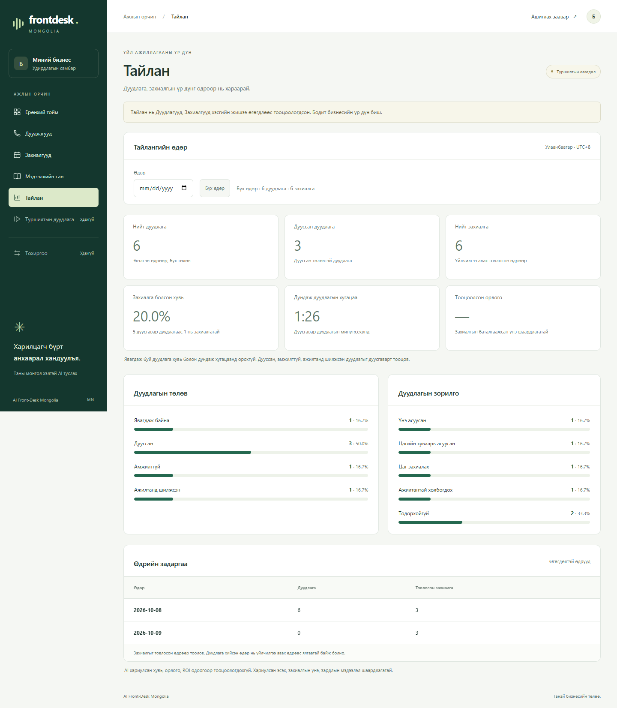
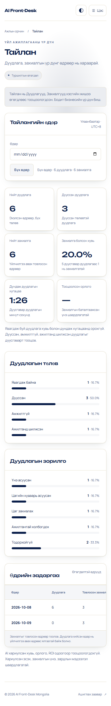
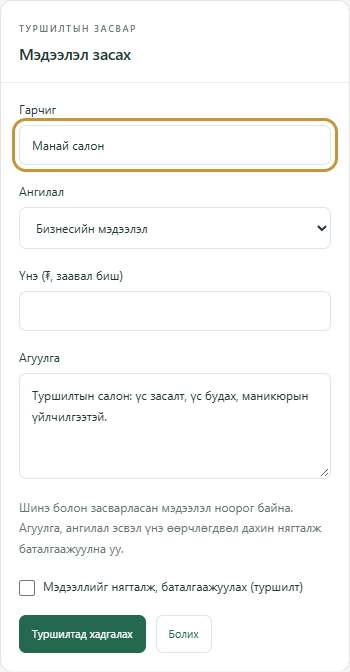
